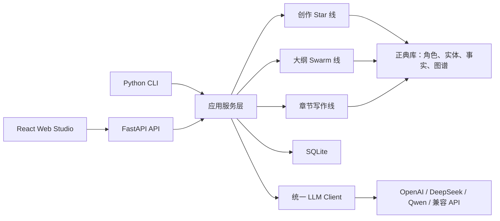

# 叙界推演引擎 / Narraverse Engine

本地优先的多模型长篇小说大纲与世界观推演工作室，围绕 LangGraph / langgraph-swarm 多 Agent 编排、正典库、关系图谱、世界规则推演、大纲推演和人工确认流程构建。

当前版本：0.2.0

> 叙界 = 叙事 + 世界。Narraverse Engine 的目标不是“帮你续写几段文字”，而是帮助作者持续推演一部长篇小说的世界、正典、结构、角色和章节。

## 为什么做这个项目

大多数 AI 写作工具擅长生成文本，但长篇小说需要的不只是文本生成：

- 角色目标、秘密、关系和成长弧必须长期一致；
- 世界规则要能跨卷、跨章节追踪；
- 伏笔需要预埋、追踪、提醒和回收；
- 大纲生成必须读取已有正典，而不是每次孤立发散；
- AI 修改应该先生成提案，由作者确认后再应用，而不是静默覆盖正文。

叙界推演引擎关注的是：**长篇小说的世界观推演、正典推演和结构化创作工程**。

## 技术优势

- **三条独立 Agent 线**
  - `creation_star`：抽卡式立项线，负责类型、标签、世界观、主角、卖点、书名和正典种子。
  - `outline_swarm`：基于 LangGraph Swarm（`langgraph-swarm`）的长篇大纲与世界构建推演线，支持 `active_agent` 动态交接和有限循环。
  - `chapter_writing`：稳定的章节写作线，包含 canon context、审校、质量门、修订、风格统一和设定更新。

- **正典优先生成**
  - 所有创作工作流都会读取 `canon_context`：项目基础信息、故事圣经、核心角色、剧情实体、世界观事实、图谱关系、未解决连续性问题和前文摘要。
  - AI 生成的设定更新默认是候选，必须经作者确认后才写入正式正典。

- **人工确认闭环**
  - 创作 Star 卡片、设定生成、大纲预览、章节修改提案和正典更新都遵循“预览 → 编辑 → 确认 → 提交”。
  - 用户手写设定不会被无来源、无置信度、无原因地覆盖。

- **提示词目录架构**
  - 长篇写作提示词集中在 `backend/app/prompts/`。
  - Agent 通过 Prompt Catalog 绑定任务提示词，避免把所有逻辑塞进单个巨大提示词。

- **模型供应商无关**
  - 支持 OpenAI、DeepSeek、通义千问/Qwen、OpenRouter、SiliconFlow、Moonshot/Kimi、智谱 GLM、Ollama 和任意 OpenAI 兼容接口。
  - Agent 配置中心可以为每个可视化工作流里的每个 Agent 单独选择模型；未配置时回退到环境变量默认模型。
  - API Key 只从环境变量读取。没有 Key 时，本地结构化 fallback 仍可跑通主要流程，方便测试和演示。

- **本地优先数据模型**
  - SQLite 存储项目、章节、角色、世界观事实、图节点、图边、版本、任务、Agent 运行记录和导出记录。
  - 本地运行不需要云账号、登录系统或托管数据库。

## 功能地图

| 模块 | 作用 |
|---|---|
| 创作 Star | 引导完成频道、类型、标签、世界观卡、主角卡、书名卡、核心矛盾、小说宪法和正典预览。 |
| 大纲 Swarm | 生成总纲、动态卷纲、批量章纲、世界构建推演、Agent 推演轨迹和可确认预览。 |
| 正典库 | 维护角色、剧情实体、世界观事实、图节点、图边、伏笔和连续性问题。 |
| 正文工作台 | 三栏式写作界面，包含章节目录、Markdown 编辑器、AI 助手、修改提案、版本和字数统计。 |
| Agent 配置 | 可视化工作流图和可编辑 Agent 提示词。 |
| 版本系统 | Agent 快照、diff 对比、回滚和分支式探索。 |
| 导出 | 支持 Markdown、TXT、HTML、PDF、EPUB、Word 等本地导出路径。 |
| CLI | 支持脚本化创建、恢复、生成章节、跑大纲、跑正典、查询、版本和导出。 |

## 架构概览



更多说明：

- [架构说明](docs/architecture.md)
- [提示词目录](docs/prompt-catalog.md)
- [路线图](docs/roadmap.md)
- [开源清单](docs/open-source-checklist.md)
- [示例种子](examples/README.md)

## 仓库结构

```text
backend/
  app/
    agents/
      creation_star/      # 抽卡式立项线
      outline_swarm/      # LangGraph Swarm 大纲推演线
      chapter_writing/    # 章节正文生成线
      shared/             # canon context、prompt catalog、trace 等共享能力
    api/v1/endpoints/     # 按领域拆分的 FastAPI 路由
      project_studio.py   # 项目、章节、大纲和工作室入口
      knowledge.py        # 角色、实体、世界事实和图谱
      writing.py          # 写作任务、批量生成和任务控制
    db/                   # SQLAlchemy 模型和数据库会话
    prompts/              # 长篇小说提示词目录
    services/             # 应用编排和持久化服务
    schemas/              # pydantic v2 请求、响应和状态模型
frontend/
  src/
    api/                  # axios API 客户端
    components/           # 共享工作室组件
    layouts/              # 项目工作室外壳
    pages/                # Dashboard、正文、大纲、设定、Agent 等页面
      OutlineStudioPage.tsx
      outline/            # frontend/src/pages/outline/ 大纲目录、编辑器、推演图和生成弹窗
    store/                # Zustand 项目状态
docs/                     # 架构、路线图、开源说明
examples/                 # 可运行的示例输入
```

关键拆分路径：

- `backend/app/api/v1/endpoints/project_studio.py`
- `backend/app/api/v1/endpoints/knowledge.py`
- `backend/app/api/v1/endpoints/writing.py`
- `frontend/src/pages/OutlineStudioPage.tsx`
- `frontend/src/pages/outline/`

## 快速开始

### 方式 A：Docker Compose

```bash
cp .env.example .env
docker compose up --build
```

启动后访问：

- Web 应用：<http://localhost:5173>
- API 文档：<http://localhost:8000/docs>

### 方式 B：本地开发

后端：

```bash
python -m venv .venv
source .venv/bin/activate
python -m pip install --upgrade pip
python -m pip install -r backend/requirements.txt

DATABASE_URL=sqlite:///./backend/data/novel_agent.db \
JOB_ARTIFACT_DIR=backend/artifacts/runs \
FRONTEND_ORIGIN=http://localhost:5173 \
python -m uvicorn --app-dir backend app.main:app --reload --host 0.0.0.0 --port 8000
```

前端：

```bash
cd frontend
corepack enable
corepack prepare pnpm@11.5.1 --activate
pnpm install

VITE_API_BASE_URL=http://localhost:8000/api pnpm dev
```

如果你在 Codex 桌面工作区中运行，也可以使用项目内置的 pnpm：

```bash
cd frontend
export PATH="/Users/mac/.cache/codex-runtimes/codex-primary-runtime/dependencies/node/bin:$PATH"
node ../.codex-tools/pnpm-11.5.1/bin/pnpm.cjs install
VITE_API_BASE_URL=http://localhost:8000/api node ../.codex-tools/pnpm-11.5.1/bin/pnpm.cjs dev
```

## LLM 配置

复制环境变量模板：

```bash
cp .env.example .env
```

常用供应商：

```bash
LLM_PROVIDER=qwen
QWEN_API_KEY=
QWEN_BASE_URL=https://dashscope.aliyuncs.com/compatible-mode/v1
QWEN_MODEL=qwen-plus

LLM_PROVIDER=deepseek
DEEPSEEK_API_KEY=
DEEPSEEK_BASE_URL=https://api.deepseek.com
DEEPSEEK_MODEL=deepseek-v4-flash

LLM_PROVIDER=openai
OPENAI_API_KEY=
OPENAI_BASE_URL=https://api.openai.com/v1
OPENAI_MODEL=gpt-4.1-mini

LLM_PROVIDER=openrouter
OPENROUTER_API_KEY=
OPENROUTER_BASE_URL=https://openrouter.ai/api/v1
OPENROUTER_MODEL=openrouter/auto

LLM_PROVIDER=siliconflow
SILICONFLOW_API_KEY=
SILICONFLOW_BASE_URL=https://api.siliconflow.cn/v1
SILICONFLOW_MODEL=Qwen/Qwen3-32B

LLM_PROVIDER=moonshot
MOONSHOT_API_KEY=
MOONSHOT_BASE_URL=https://api.moonshot.cn/v1
MOONSHOT_MODEL=kimi-k2-0711-preview

LLM_PROVIDER=zhipu
ZHIPU_API_KEY=
ZHIPU_BASE_URL=https://open.bigmodel.cn/api/paas/v4
ZHIPU_MODEL=glm-4-plus

LLM_PROVIDER=ollama
OLLAMA_BASE_URL=http://localhost:11434/v1
OLLAMA_MODEL=qwen2.5:7b
```

设置 `LLM_REQUIRE_REMOTE=true` 后，如果缺少 API Key 或远程调用失败，系统会直接报错，不再使用本地结构化 fallback。

模型目录接口：`GET /api/llm/models`。Agent 模型覆盖接口：`GET/PUT /api/agent-model-configs`，以及 `DELETE /api/agent-model-configs/{workflow_id}/{agent_name}`。

## CLI

```bash
source .venv/bin/activate
python main.py new
python main.py resume
python main.py plan --count 3
python main.py generate-chapter --chapter-no 1
python main.py versions
python main.py character_map
python main.py query "谁是主角？"
python main.py export --format markdown
```

大纲 Swarm 示例：

```bash
source .venv/bin/activate
python main.py init --name "长篇推演项目" --genre "都市脑洞" --tone "搞笑腹黑"
python main.py set-input --worldview worldview.txt --story "林缺用反常识操作让怪谈规则破防。"
python main.py run-full
python main.py export --outline --format markdown
```

正典补全示例：

```bash
source .venv/bin/activate
python main.py canon-run --input data/sample_input.json --output outputs/final_outline.md
```

`examples/` 下提供了几个示例输入：

```bash
python main.py canon-run --input examples/urban-fantasy/sample_input.json --output outputs/urban-fantasy-final-outline.md
python main.py canon-run --input examples/xuanhuan/sample_input.json --output outputs/xuanhuan-final-outline.md
python main.py canon-run --input examples/romance/sample_input.json --output outputs/romance-final-outline.md
```

## 测试

后端：

```bash
source .venv/bin/activate
python -m pytest backend/tests -q
```

前端：

```bash
cd frontend
pnpm test
pnpm build
```

前端构建可能提示部分 chunk 较大，这是因为项目包含 ECharts、Markdown 工具链和 Ant Design。更多说明见 [前端构建体积分析](docs/前端构建体积分析.md)。

## API 概览

应用同时提供 `/api` 和 `/api/v1` 前缀。主要领域：

- 项目和状态：`/api/projects`
- 创作 Star：`/api/projects/{id}/creation/sessions`
- 故事圣经和 canon context：`/api/projects/{id}/story-bible`、`/api/projects/{id}/canon/context`
- 角色、实体、世界事实、图谱：`/api/projects/{id}/characters`、`/entities`、`/world-facts`、`/graph`
- 大纲生成：`/api/projects/{id}/outline/book/generate`、`/outline/chapters/batch-generate`
- Agent 与模型：`/api/agents`、`/api/workflows`、`/api/llm/models`、`/api/agent-model-configs`
- 写作任务：`/api/write/generate`、`/api/write/batch-generate`
- 版本：`/api/versions`
- 导出：`/api/export`

后端运行后，可在 `/docs` 查看 OpenAPI 文档。

## 这个项目不做什么

- 不是托管 SaaS 平台。
- 不做用户登录、团队空间或云协作。
- 不做自动投稿或平台账号托管。
- 不默认引入 Neo4j 或复杂向量数据库。
- 不替代作者判断。AI 生成内容在确认前都只是提案。

## 贡献

欢迎贡献这些方向：

- 提示词目录改进；
- 更多中文网文类型模板；
- 正典和连续性检查；
- 导出模板；
- 长时间写作场景的 UI/UX 优化；
- OpenAI 兼容模型供应商适配。

请先阅读 [CONTRIBUTING.md](CONTRIBUTING.md)。

## 许可协议

本项目使用 MIT License。详见 [LICENSE](LICENSE)。
