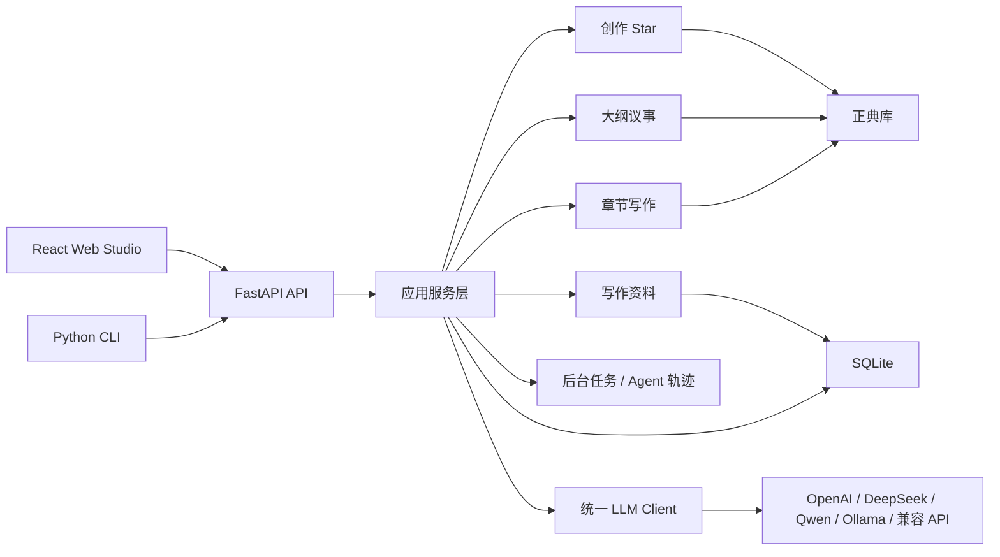

# 叙界推演引擎 / Narraverse Engine

本地优先的多模型长篇小说创作工作室，用回合制 Agent 议事、正典库、关系图谱和人工确认流程，帮助作者持续推演一部长篇小说的世界、结构、角色、伏笔和正文。


当前实现版本：`0.2.0 Alpha`
目标能力集：`Studio 1.0`
API 合约阶段：`1.0 Draft`

> 叙界 = 叙事 + 世界。Narraverse Engine 的目标不是“帮你续写几段文字”，而是帮助作者把长篇小说当成一个可持续维护的叙事工程。

## 目录

- [快速开始](#快速开始)
- [核心功能](#核心功能)
- [核心工作流](#核心工作流)
- [项目状态](#项目状态)
- [架构概览](#架构概览)
- [AI 辅助开发（可选）](#ai-辅助开发可选)
- [LLM 配置](#llm-配置)
- [CLI 与 API](#cli-与-api)
- [测试与验证](#测试与验证)
- [故障排查](#故障排查)
- [隐私与安全](#隐私与安全)
- [贡献](#贡献)

## 快速开始

### 最快启动

macOS / Linux / Git Bash / WSL：

```bash
git clone https://github.com/wssyh339/Narraverse-Engine.git
cd Narraverse-Engine
cp .env.example .env
docker compose up --build
```

Windows PowerShell：

```powershell
git clone https://github.com/wssyh339/Narraverse-Engine.git
cd Narraverse-Engine
Copy-Item .env.example .env
docker compose up --build
```

启动后访问：

- Web 应用：<http://localhost:5173>
- API 文档：<http://localhost:8000/docs>
- API 快速检查：<http://localhost:8000/api/projects>

### 支持矩阵

| 使用者 | 推荐方式 | 支持系统 | 需要预装 |
|---|---|---|---|
| 普通用户、本地体验、GitHub 下载后快速启动 | Docker Compose | Windows 10/11、macOS、Linux | Git、Docker Desktop 或 Docker Engine、Docker Compose v2 |
| 开发者、需要调试后端或前端 | 本地源码启动 | Windows 10/11、macOS、Linux | Git、Python 3.10+、Node.js 24.14.0、pnpm 11.5.1 |
| 无 Docker 的服务器或虚拟机 | 本地源码启动 | Linux、macOS、Windows Server | Python、Node.js、可写本地磁盘 |

默认数据写入本机 SQLite 和本地 artifacts。不要把 `.env`、`data/`、`backend/data/`、`backend/artifacts/`、`output/`、`outputs/`、`logs/`、`test-artifacts/` 上传到 GitHub。

### 从 GitHub 获取代码

```bash
git clone https://github.com/wssyh339/Narraverse-Engine.git
cd Narraverse-Engine
```

如果是下载 GitHub ZIP，解压后进入项目根目录即可。

### 方式 A：Docker Compose（推荐）

macOS / Linux / Windows PowerShell 都可以使用：

```bash
cp .env.example .env
docker compose up --build
```

Windows PowerShell 如果没有 `cp` 命令，使用：

```powershell
Copy-Item .env.example .env
docker compose up --build
```

启动后访问：

- Web 应用：<http://localhost:5173>
- API 文档：<http://localhost:8000/docs>
- API 快速检查：<http://localhost:8000/api/projects>

常用 Docker 命令：

```bash
docker compose logs -f
docker compose down
docker compose down -v
```

`docker compose down -v` 会删除 Docker volume 中的本地数据库和 artifacts，只在确认要清空本地数据时使用。

如果 Docker Hub 拉取基础镜像超时，可以在 `.env` 中切换镜像源和包源：

```env
DOCKER_NODE_IMAGE=docker.1ms.run/library/node:24-alpine
DOCKER_PYTHON_IMAGE=docker.1ms.run/library/python:3.13-slim
NPM_REGISTRY=https://registry.npmmirror.com
PIP_INDEX_URL=https://pypi.tuna.tsinghua.edu.cn/simple
```

当前 `docker-compose.yml` 只启动后端和前端，不需要单独启动 Qdrant、Redis、Postgres 或其他外部服务。`.env.example` 中的 Qdrant 变量只作为可选记忆增强预留。

如果部署在远程服务器，并且浏览器不是运行在服务器本机，请把 `.env` 中的 `VITE_API_BASE_URL` 改为服务器可访问地址，例如：

```env
VITE_API_BASE_URL=http://<server-ip-or-domain>:8000/api
```

修改 `VITE_*` 变量后需要重新构建前端镜像：

```bash
docker compose up --build
```

### 方式 B：本地开发

准备环境变量：

```bash
cp .env.example .env
```

Windows PowerShell：

```powershell
Copy-Item .env.example .env
```

本地开发默认读取项目根目录 `.env`。端口、API 地址、数据库路径和任务产物目录都集中在 `.env` 中维护：

```env
BACKEND_HOST=0.0.0.0
BACKEND_PORT=8000
FRONTEND_HOST=0.0.0.0
FRONTEND_PORT=5173
FRONTEND_ORIGIN=http://localhost:5173
VITE_API_BASE_URL=http://localhost:8000/api
DATABASE_URL=sqlite:///./data/novel_agent.db
JOB_ARTIFACT_DIR=artifacts/runs
```

后端（macOS / Linux / Git Bash / WSL）：

```bash
python3 -m venv .venv
source .venv/bin/activate
python -m pip install --upgrade pip
python -m pip install -r backend/requirements.txt
./scripts/dev-backend.sh
```

后端（Windows PowerShell）：

```powershell
py -3 -m venv .venv
.\.venv\Scripts\Activate.ps1
python -m pip install --upgrade pip
python -m pip install -r backend/requirements.txt
$env:BACKEND_HOST = "0.0.0.0"
$env:BACKEND_PORT = "8000"
$env:DATABASE_URL = "sqlite:///./data/novel_agent.db"
$env:JOB_ARTIFACT_DIR = "artifacts/runs"
python -m uvicorn --app-dir backend app.main:app --reload --host $env:BACKEND_HOST --port $env:BACKEND_PORT
```

如果 PowerShell 阻止激活虚拟环境，可在当前终端临时执行：

```powershell
Set-ExecutionPolicy -Scope Process -ExecutionPolicy Bypass
```

前端（新开一个终端，macOS / Linux / Git Bash / WSL）：

```bash
cd frontend
corepack enable
corepack prepare pnpm@11.5.1 --activate
pnpm install
cd ..
./scripts/dev-frontend.sh
```

前端（Windows PowerShell）：

```powershell
cd frontend
corepack enable
corepack prepare pnpm@11.5.1 --activate
pnpm install
$env:VITE_API_BASE_URL = "http://localhost:8000/api"
pnpm dev
```

一键启动前后端只面向 Bash 环境：

```bash
./scripts/dev.sh
```

如果端口被占用，只需要调整 `.env` 中的 `BACKEND_PORT`、`FRONTEND_PORT`、`FRONTEND_ORIGIN` 和 `VITE_API_BASE_URL`。

### AI 辅助开发（可选）

仓库提供本地代码图谱、ADR / Mermaid 架构事实和 Repomix 上下文快照。它们不属于产品运行时，不会改变后端、前端、SQLite 或默认 Docker Compose。macOS、Linux 或 WSL 可运行：

```bash
./scripts/code-intel.sh install
./scripts/code-intel.sh index
./scripts/code-intel.sh status
./scripts/build-ai-context.sh --profile full
./scripts/verify-ai-context.sh --static
# 手动或定期执行完整验收
./scripts/verify-ai-context.sh --full
```

- `codebase-memory-mcp` 固定为 `0.9.0`。服务端代理只暴露 `search_graph`、`query_graph`、`trace_path`、`get_code_snippet`、`get_graph_schema`、`get_architecture`、`search_code` 和 `index_status` 八个查询工具；客户端 allowlist 只是附加防线，索引、删除和跨仓库能力不会由服务端提供。
- 图谱默认以 Git index 判断文件成员资格（已提交文件与 staged 新文件），但读取当前工作树内容，因此能反映尚未提交的修改。真正的 untracked 文件应优先用 `git add` 纳入 index；明确的一次性草稿才可通过精确路径 `--allow-untracked PATH` 加入。
- 图谱构建先生成独立的只读输入副本和 manifest，不通过硬链接把索引器连接到工作树。索引仅位于 `.codebase-memory/`，创建和刷新必须显式执行。
- Repomix 固定为 `1.17.0`，提供 `full`、`backend`、`frontend`、`tooling` 四个 profile；每次构建都按 manifest 复制不可变的只读输入，再生成 `.ai-context/` 快照。其运行时使用独立的 package/lock，并在隔离目录以 `npm ci --ignore-scripts` 干净安装，不进入产品依赖。
- `--static` 只检查规则、配置、忽略策略和单元测试，不运行第三方 AI 二进制，适合常规 CI/PR；`--full` 会从新鲜输入重建 Repomix 快照与代码图谱，并检查 MCP 握手、manifest、排除规则和查询准确性，适合工具变更后的手动或定期验收。
- `.codebase-memory/` 与 `.ai-context/` 都是可重建生成物，已被 Git 忽略，不得提交。
- 首次安装会从 GitHub 下载固定校验和的代码图谱二进制。以上工具都不应把仓库源码上传到 Wiki 或其他远程服务；DeepWiki Open 继续禁用，不得克隆、安装、运行或生成 Wiki 缓存。
- Windows 原生 PowerShell 请通过 WSL 使用这些可选脚本。

完整的安装、升级、卸载、隐私和故障处理说明见 [AI 辅助开发指南](docs/ai-assisted-development.md)，架构决策见 [ADR 索引](docs/adr/README.md)。

### 部署前检查

准备上传到 GitHub 或打 tag 前，建议运行：

```bash
python3 scripts/verify-agents-guidance.py
docker compose config --quiet
python -m pytest backend/tests -q
cd frontend
pnpm test
pnpm build
```

发布检查清单：

- `.env` 不提交，只提交 `.env.example`。
- 不提交 `data/`、`backend/data/`、`backend/artifacts/`、`output/`、`outputs/`、`logs/`、`test-artifacts/`。
- README 中的端口、Node/Python 版本、Docker 命令必须与 `docker-compose.yml`、`frontend/package.json`、`backend/requirements.txt` 一致。
- 若新增部署方式，必须同步更新根规则路由、`scripts/AGENTS.md`、README 和验证命令。

## 核心功能

| 模块 | 作用 |
|---|---|
| 创作 Star | 通过频道、类型、标签、世界观卡、主角卡、书名卡、核心矛盾和小说宪法完成立项。 |
| 大纲议事 | 多个 Agent 回合制讨论总纲、逐卷卷纲和逐章章纲；用户可加入、@角色、打断，并在确认后写入正式大纲和正典。 |
| 正典库 | 维护角色、剧情实体、世界观事实、图节点、图边、伏笔和连续性问题。 |
| 正文工作台 | 三栏式写作界面，包含章节目录、Markdown 编辑器、AI 助手、修改提案、版本和字数统计。 |
| 批量生成 | 后台逐章生成正文，任务可恢复、可暂停、可重试，并显示长任务进度。 |
| 写作资料 | 笔记页支持导入已有小说、保存 Method Pack、保存对标资产，并生成 solo/lean/full 审稿计划。 |
| Agent 配置 | 查看可视化工作流，编辑 Agent 提示词，并按 Agent 配置模型。 |
| 版本系统 | 保存 Agent 快照、diff 对比、回滚和分支式探索。 |
| 导出 | 支持 Markdown、TXT、HTML、PDF、EPUB、Word 等本地导出路径；当前 PDF/EPUB/Word 属于本地最小可读实现，不等同完整排版引擎。 |
| CLI | 支持脚本化创建、恢复、章节生成、查询、版本和导出。 |

## 核心工作流

```text
创作 Star 立项
  -> 世界观 / 主角 / 书名候选
  -> 核心矛盾系统
  -> 小说宪法
  -> 正典候选确认
  -> 项目入库

大纲议事
  -> 讨论总纲
  -> 确认总纲并更新正典
  -> 逐卷讨论卷纲
  -> 每卷确认后更新正典
  -> 逐章讨论章纲
  -> 每章确认后更新正典

章节写作
  -> 构建 canon_context
  -> 章节写前准备
  -> 章节卡和场景细纲
  -> 生成章节正文
  -> 审校 / 事实核查 / 质量门
  -> 修订或定稿
  -> 摘要、伏笔、正典更新
```

这个项目的核心原则是：

- **不是聊天续写**：重点是长篇正典、结构和连续性。
- **不是一次性大纲**：总纲、卷纲、章纲分阶段讨论和确认。
- **不是 AI 静默写库**：重要变更保留来源、置信度和人工确认。
- **不是单模型绑定**：支持多个 OpenAI 兼容 Provider 和本地 Ollama。

## 项目状态

当前已验证：

| 场景 | 最近证据 |
|---|---|
| Docker Compose 配置 | 2026-07-04 本地执行 `docker compose config --quiet` 通过；当前机器 Docker daemon 未运行，未做镜像实际构建。 |
| 后端合同测试 | 2026-07-04 本地执行 `python -m pytest backend/tests/test_core_apis.py backend/tests/test_agent_prompt_runtime_contract.py -q`，48 passed。 |
| 前端合同测试 | 2026-07-04 本地执行 `pnpm test`，39 passed。 |
| 前端生产构建 | 2026-07-04 本地执行 `pnpm build` 通过，有 Vite chunk size 警告。 |
| 真实 LLM 大纲议事 | 见 [DeepSeek 大纲议事端到端测试](docs/test-reports/2026-06-17-deepseek-outline-debate-e2e.md) 与 [动态 Agent 大纲议事真实 LLM 测试](docs/test-reports/2026-06-21-outline-debate-dynamic-agents-real-llm.md)。 |
| 长篇压力流程 | 见 [大纲议事质量升级实现记录](docs/outline_debate_quality_upgrade_implementation.md) 和 `scripts/run_real_20w_4000_flow.py`。 |

仍在完善：

- 百万字级长篇的质量门、润色和连续性复审闭环。
- 更细粒度的正典冲突自动审计。
- 长任务日志压缩和分层归档。
- 更多中文网文类型模板。
- 更完整的导出模板和排版预设。

不做的事：

- 不做托管 SaaS 平台。
- 不做用户登录、团队空间或云协作。
- 不做自动投稿或平台账号托管。
- 不默认引入 Neo4j 或复杂向量数据库。
- 不替代作者判断。AI 生成内容在确认前都只是提案或候选。

## 架构概览



仓库结构：

```text
AGENTS.md                 # 全局基线、作用域路由和稳定规则 ID
backend/
  AGENTS.md               # 后端、Agent、API、数据和 LLM 细则
  app/
    agents/
      creation_star/      # 抽卡式立项线
      chapter_writing/    # 章节正文生成线
      shared/             # canon context、prompt catalog、trace 等共享能力
    api/v1/endpoints/     # 按领域拆分的 FastAPI 路由
      project_studio.py   # backend/app/api/v1/endpoints/project_studio.py
      knowledge.py        # backend/app/api/v1/endpoints/knowledge.py
      writing.py          # backend/app/api/v1/endpoints/writing.py
    db/                   # SQLAlchemy 模型和数据库会话
    prompts/              # 长篇小说提示词目录
    services/             # 应用编排和持久化服务
    schemas/              # pydantic v2 请求、响应和状态模型
frontend/
  AGENTS.md               # React 工作室、交互审批和前端验证
  src/
    api/                  # axios API 客户端
    components/           # 共享工作室组件
    layouts/              # 项目工作室外壳
    pages/                # Dashboard、正文、大纲、设定、Agent 等页面
      outline/            # frontend/src/pages/outline/ 大纲目录、编辑器和议事面板
    pages/OutlineStudioPage.tsx
    store/                # Zustand 项目状态
scripts/
  AGENTS.md               # 启动、部署、AI 上下文工具和 CI
docs/
  AGENTS.md               # 文档事实层、ADR、Mermaid 和历史资料
                           # 其余为架构、路线图、验证报告和开源说明
examples/                 # 可运行的示例输入
```

Agent 三线架构：

- `creation_star`：抽卡式立项候选生成与提交编排。
- `outline_debate`：大纲议事流，入口为 `backend/app/api/v1/endpoints/outline_debate.py` 与 `backend/app/services/outline_debate_service.py`。
- `chapter_writing`：章节正文生成、质量门和章后更新闭环。
- `workbench`：已有小说导入、Method Pack、对标资产、审稿计划、笔记和编辑提案。
- 2026-07-04 前的历史大纲实现已归档，不再作为大纲生成入口。

更多文档：

- [分层项目规则入口](AGENTS.md)
- [架构说明](docs/architecture.md)
- [AI 辅助开发指南](docs/ai-assisted-development.md)
- [架构决策记录](docs/adr/README.md)
- [提示词目录](docs/prompt-catalog.md)
- [路线图](docs/roadmap.md)
- [开源清单](docs/open-source-checklist.md)
- [示例种子](examples/README.md)

## LLM 配置

复制环境变量模板：

```bash
cp .env.example .env
```

最小远程模型配置示例：

```env
LLM_PROVIDER=deepseek
DEEPSEEK_API_KEY=your_api_key
DEEPSEEK_BASE_URL=https://api.deepseek.com
DEEPSEEK_MODEL=deepseek-v4-flash
LLM_REQUIRE_REMOTE=true
```

也可以使用通用 OpenAI 兼容配置：

```env
LLM_PROVIDER=openai
OPENAI_API_KEY=your_api_key
OPENAI_BASE_URL=https://api.openai.com/v1
OPENAI_MODEL=gpt-4.1-mini
```

支持的 Provider 包括：

- OpenAI
- DeepSeek
- 通义千问 / Qwen
- OpenRouter
- SiliconFlow
- Moonshot / Kimi
- 智谱 GLM
- Ollama
- 任意 OpenAI 兼容 `LLM_BASE_URL + LLM_API_KEY`

完整变量见 [.env.example](.env.example)。模型目录接口：`GET /api/llm/models`。Agent 模型覆盖接口：`GET/PUT /api/agent-model-configs`。

没有 API Key 时，系统允许本地结构化 fallback 跑通主要流程，方便测试和演示。设置 `LLM_REQUIRE_REMOTE=true` 后，缺少 API Key 或远程调用失败会直接报错。

## CLI 与 API

常用 CLI（macOS / Linux / Git Bash / WSL）：

```bash
source .venv/bin/activate
python main.py new
python main.py resume
python main.py generate-chapter --chapter-no 1
python main.py versions
python main.py character_map
python main.py query "谁是主角？"
python main.py export --format markdown
```

常用 API 入口：

- `POST /api/projects/{project_id}/import/novel`：导入已有正文，生成章节草稿和导入报告。
- `GET/POST /api/projects/{project_id}/method-packs`：管理 Method Pack。
- `GET/POST /api/projects/{project_id}/reference-assets`：管理对标资产。
- `POST /api/projects/{project_id}/review/plan`：生成 solo、lean 或 full 审稿计划。

Windows PowerShell：

```powershell
.\.venv\Scripts\Activate.ps1
python main.py new
python main.py resume
python main.py generate-chapter --chapter-no 1
python main.py versions
python main.py character_map
python main.py query "谁是主角？"
python main.py export --format markdown
```

CLI 不再提供旧章纲规划命令；大纲生成请使用 Web 大纲页或 `/api/projects/{project_id}/outline/debate/sessions` 议事接口。

大纲议事接口示例：

```bash
PROJECT_ID="prj_xxx"
curl -s -X POST "http://127.0.0.1:8000/api/projects/${PROJECT_ID}/outline/debate/sessions" \
  -H "Content-Type: application/json" \
  -d '{"brief":"从作品正典出发，讨论百万字长篇大纲。"}'
```

主要 API 领域：

- 项目和状态：`/api/projects`
- 创作 Star：`/api/projects/{id}/creation/sessions`
- 故事圣经和 canon context：`/api/projects/{id}/story-bible`、`/api/projects/{id}/canon/context`
- 角色、实体、世界事实、图谱：`/api/projects/{id}/characters`、`/entities`、`/world-facts`、`/graph`
- 大纲议事：`/api/projects/{id}/outline/debate/sessions`
- 写作资料：`/api/projects/{id}/import/novel`、`/method-packs`、`/reference-assets`、`/review/plan`
- Agent 与模型：`/api/agents`、`/api/workflows`、`/api/llm/models`、`/api/agent-model-configs`
- 写作任务：`/api/write/generate`、`/api/write/batch-generate`
- 版本：`/api/versions`
- 导出：`/api/export`

后端运行后，可在 `/docs` 查看 OpenAPI 文档。

## 测试与验证

后端：

```bash
source .venv/bin/activate
python -m pytest backend/tests -q
python -m pytest backend/tests/test_core_apis.py backend/tests/test_agent_prompt_runtime_contract.py -q
```

前端：

```bash
cd frontend
pnpm test
node --test tests/agents-page-contract.test.mjs tests/frontend-contract.test.mjs
pnpm build
```

最小 CI 位于 `.github/workflows/ci.yml`，默认运行上面的后端/前端合同测试。

真实 20 万字流程脚本也提供轻量 smoke：

```bash
python scripts/run_real_20w_4000_flow.py --stage smoke --smoke-chapter-count 3
```

验证报告：

| 场景 | 报告 |
|---|---|
| DeepSeek 大纲议事端到端测试 | [2026-06-17-deepseek-outline-debate-e2e](docs/test-reports/2026-06-17-deepseek-outline-debate-e2e.md) |
| DeepSeek 大纲议事用户插入测试 | [2026-06-17-deepseek-outline-debate-user-insertion-e2e](docs/test-reports/2026-06-17-deepseek-outline-debate-user-insertion-e2e.md) |
| 动态 Agent 大纲议事真实 LLM 测试 | [2026-06-21-outline-debate-dynamic-agents-real-llm](docs/test-reports/2026-06-21-outline-debate-dynamic-agents-real-llm.md) |

前端构建可能提示部分 chunk 较大，这是因为项目包含 ECharts、Markdown 工具链和 Ant Design。更多说明见 [前端构建体积分析](docs/前端构建体积分析.md)。

## 故障排查

### Docker daemon 没启动

如果看到类似 `failed to connect to the docker API`，先启动 Docker Desktop 或 Docker Engine，再重新运行：

```bash
docker compose up --build
```

### Docker Hub 拉取超时

在 `.env` 中切换镜像源和包源：

```env
DOCKER_NODE_IMAGE=docker.1ms.run/library/node:24-alpine
DOCKER_PYTHON_IMAGE=docker.1ms.run/library/python:3.13-slim
NPM_REGISTRY=https://registry.npmmirror.com
PIP_INDEX_URL=https://pypi.tuna.tsinghua.edu.cn/simple
```

### 端口被占用

修改 `.env`：

```env
BACKEND_PORT=8001
FRONTEND_PORT=5174
FRONTEND_ORIGIN=http://localhost:5174
VITE_API_BASE_URL=http://localhost:8001/api
```

Docker 模式下修改 `VITE_*` 后需要重新构建：

```bash
docker compose up --build
```

### Windows PowerShell 不能激活虚拟环境

当前终端临时放开脚本执行：

```powershell
Set-ExecutionPolicy -Scope Process -ExecutionPolicy Bypass
.\.venv\Scripts\Activate.ps1
```

### Node 版本警告

项目锁定 `Node.js 24.14.0` 和 `pnpm 11.5.1`。如果只是运行测试时看到 engine warning，但命令通过，可以继续开发；发布前建议切到锁定版本。

### 远程服务器前端能打开但 API 连不上

把 `.env` 中的 `VITE_API_BASE_URL` 改为浏览器能访问的后端地址：

```env
VITE_API_BASE_URL=http://<server-ip-or-domain>:8000/api
```

然后重新构建前端：

```bash
docker compose up --build
```

### 没有 API Key 是否能启动

可以启动。默认 `LLM_REQUIRE_REMOTE=false`，系统允许本地结构化 fallback 跑通主要流程。真实模型验收时设置：

```env
LLM_REQUIRE_REMOTE=true
```

## 隐私与安全

- API Key 只从后端环境变量读取，前端不接触密钥。
- 默认使用本地 SQLite，数据保存在本机。
- 配置远程 LLM 后，提示词、正文片段和正典上下文会发送给对应模型供应商。
- `LLM_REQUIRE_REMOTE=false` 时可使用本地结构化 fallback，但该模式不代表真实模型质量。
- 本项目不包含登录、租户隔离或公网多用户权限系统，不建议直接暴露到公网。
- 请勿把包含 API Key、私密正文或真实用户数据的 `.env`、`data/`、`logs/`、`output/`、`outputs/` 提交到公开仓库。

安全问题请参考 [SECURITY.md](SECURITY.md)。

## 贡献

欢迎贡献这些方向：

- 提示词目录改进。
- 更多中文网文类型模板。
- 正典和连续性检查。
- 导出模板。
- 长时间写作场景的 UI/UX 优化。
- OpenAI 兼容模型供应商适配。
- 示例项目和真实验证报告。

请先阅读 [CONTRIBUTING.md](CONTRIBUTING.md)。行为准则见 [CODE_OF_CONDUCT.md](CODE_OF_CONDUCT.md)。

## 许可协议

本项目使用 MIT License。详见 [LICENSE](LICENSE)。
