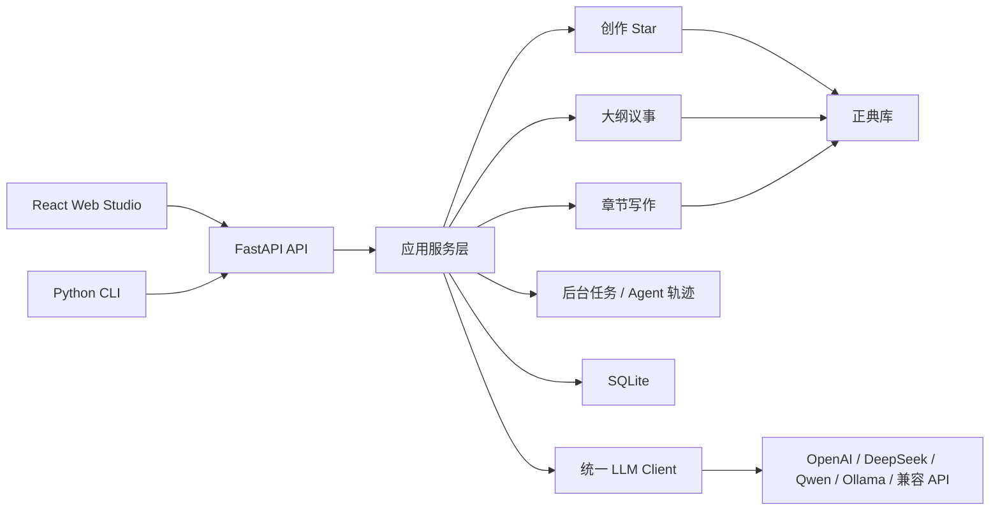

# 叙界推演引擎 / Narraverse Engine

本地优先的多模型长篇小说创作工作室，用回合制 Agent 议事、正典库、关系图谱和人工确认流程，帮助作者持续推演一部长篇小说的世界、结构、角色、伏笔和正文。


当前版本：`0.2.0`  
当前阶段：`Alpha / 本地优先开发版`

> 叙界 = 叙事 + 世界。Narraverse Engine 的目标不是“帮你续写几段文字”，而是帮助作者把长篇小说当成一个可持续维护的叙事工程。

## 目录

- [快速开始](#快速开始)
- [核心功能](#核心功能)
- [核心工作流](#核心工作流)
- [项目状态](#项目状态)
- [界面预览](#界面预览)
- [架构概览](#架构概览)
- [LLM 配置](#llm-配置)
- [CLI 与 API](#cli-与-api)
- [测试与验证](#测试与验证)
- [隐私与安全](#隐私与安全)
- [贡献](#贡献)

## 快速开始

### 方式 A：Docker Compose

```bash
cp .env.example .env
docker compose up --build
```

启动后访问：

- Web 应用：<http://localhost:5173>
- API 文档：<http://localhost:8000/docs>

如果 Docker Hub 拉取基础镜像超时，可以在 `.env` 中切换镜像源和包源：

```env
DOCKER_NODE_IMAGE=docker.1ms.run/library/node:24-alpine
DOCKER_PYTHON_IMAGE=docker.1ms.run/library/python:3.13-slim
NPM_REGISTRY=https://registry.npmmirror.com
PIP_INDEX_URL=https://pypi.tuna.tsinghua.edu.cn/simple
```

### 方式 B：本地开发

本地开发默认读取项目根目录 `.env`。先复制配置模板：

```bash
cp .env.example .env
```

后端：

```bash
python -m venv .venv
source .venv/bin/activate
python -m pip install --upgrade pip
python -m pip install -r backend/requirements.txt

./scripts/dev-backend.sh
```

前端：

```bash
cd frontend
corepack enable
corepack prepare pnpm@11.5.1 --activate
pnpm install
cd ..

./scripts/dev-frontend.sh
```

默认端口和 API 地址在 `.env` 中维护：

```env
BACKEND_PORT=8000
FRONTEND_PORT=5173
FRONTEND_ORIGIN=http://localhost:5173
VITE_API_BASE_URL=http://localhost:8000/api
DATABASE_URL=sqlite:///./data/novel_agent.db
```

如果端口被占用，修改 `.env` 中的 `BACKEND_PORT`、`FRONTEND_PORT`、`FRONTEND_ORIGIN` 和 `VITE_API_BASE_URL`。前端 `VITE_*` 变量属于构建期配置；Docker 模式下修改后需要重新构建。

## 核心功能

| 模块 | 作用 |
|---|---|
| 创作 Star | 通过频道、类型、标签、世界观卡、主角卡、书名卡、核心矛盾和小说宪法完成立项。 |
| 大纲议事 | 多个 Agent 回合制讨论总纲、逐卷卷纲和逐章章纲；用户可加入、@角色、打断，并在确认后写入正式大纲和正典。 |
| 正典库 | 维护角色、剧情实体、世界观事实、图节点、图边、伏笔和连续性问题。 |
| 正文工作台 | 三栏式写作界面，包含章节目录、Markdown 编辑器、AI 助手、修改提案、版本和字数统计。 |
| 批量生成 | 后台逐章生成正文，任务可恢复、可暂停、可重试，并显示长任务进度。 |
| Agent 配置 | 查看可视化工作流，编辑 Agent 提示词，并按 Agent 配置模型。 |
| 版本系统 | 保存 Agent 快照、diff 对比、回滚和分支式探索。 |
| 导出 | 支持 Markdown、TXT、HTML、PDF、EPUB、Word 等本地导出路径。 |
| CLI | 支持脚本化创建、恢复、章节生成、查询、版本和导出。 |

## 核心工作流

```text
创作 Star 立项
  -> 世界观 / 主角 / 书名候选
  -> 核心矛盾系统
  -> 小说宪法
  -> 正典候选确认
  -> 项目入库

大纲议事
  -> 讨论总纲
  -> 确认总纲并更新正典
  -> 逐卷讨论卷纲
  -> 每卷确认后更新正典
  -> 逐章讨论章纲
  -> 每章确认后更新正典

章节写作
  -> 构建 canon_context
  -> 生成章节正文
  -> 审校 / 事实核查 / 质量门
  -> 修订或定稿
  -> 摘要、伏笔、正典更新
```

这个项目的核心原则是：

- **不是聊天续写**：重点是长篇正典、结构和连续性。
- **不是一次性大纲**：总纲、卷纲、章纲分阶段讨论和确认。
- **不是 AI 静默写库**：重要变更保留来源、置信度和人工确认。
- **不是单模型绑定**：支持多个 OpenAI 兼容 Provider 和本地 Ollama。

## 项目状态

当前已验证：

- Docker Compose 本地启动。
- React + FastAPI 本地开发启动。
- 创作 Star 分步立项。
- 大纲议事流式讨论与用户插入意见。
- 批量正文后台任务、进度恢复和失败重试入口。
- Markdown 导出。
- 真实 LLM 的大纲议事端到端测试。
- 真实 LLM 的 `50` 章 / `20` 万字级批量正文生成压力测试。

仍在完善：

- 百万字级长篇的质量门、润色和连续性复审闭环。
- 更细粒度的正典冲突自动审计。
- 长任务日志压缩和分层归档。
- 更多中文网文类型模板。
- 更完整的导出模板和排版预设。

不做的事：

- 不做托管 SaaS 平台。
- 不做用户登录、团队空间或云协作。
- 不做自动投稿或平台账号托管。
- 不默认引入 Neo4j 或复杂向量数据库。
- 不替代作者判断。AI 生成内容在确认前都只是提案或候选。

## 界面预览

产品的核心不是单点生成，而是从立项、议事、正文生产到长任务监控的完整创作工作室。

### 创作 Star 首屏

频道、类型、标签、读者体验、规模参数和初始想法会先被收束成创作种子，再进入世界观、主角、书名包装、核心矛盾和小说宪法流程。

### 大纲议事流式讨论

大纲不走旧式一次性生成，而是由 Agent 回合制发言。作者可以加入讨论、@指定角色、打断和确认，候选结论在确认后才写入正式大纲与正典。

### 批量生成与长任务监控

批量正文生成按章节保存进度，支持任务恢复、暂停、取消、重试，并展示当前 Agent 阶段、预计剩余时间和逐章结果。

## 架构概览



仓库结构：

```text
backend/
  app/
    agents/
      creation_star/      # 抽卡式立项线
      chapter_writing/    # 章节正文生成线
      shared/             # canon context、prompt catalog、trace 等共享能力
    api/v1/endpoints/     # 按领域拆分的 FastAPI 路由
      project_studio.py   # backend/app/api/v1/endpoints/project_studio.py
      knowledge.py        # backend/app/api/v1/endpoints/knowledge.py
      writing.py          # backend/app/api/v1/endpoints/writing.py
    db/                   # SQLAlchemy 模型和数据库会话
    prompts/              # 长篇小说提示词目录
    services/             # 应用编排和持久化服务
    schemas/              # pydantic v2 请求、响应和状态模型
frontend/
  src/
    api/                  # axios API 客户端
    components/           # 共享工作室组件
    layouts/              # 项目工作室外壳
    pages/                # Dashboard、正文、大纲、设定、Agent 等页面
      outline/            # frontend/src/pages/outline/ 大纲目录、编辑器和议事面板
    pages/OutlineStudioPage.tsx
    store/                # Zustand 项目状态
docs/                     # 架构、路线图、验证报告和开源说明
examples/                 # 可运行的示例输入
```

Agent 三线架构：

- `creation_star`：抽卡式立项候选生成与提交编排。
- `outline_debate`：大纲议事流，入口为 `backend/app/api/v1/endpoints/outline_debate.py` 与 `backend/app/services/outline_debate_service.py`。
- `chapter_writing`：章节正文生成、质量门和章后更新闭环。
- legacy `outline_swarm` 已删除，不再作为大纲生成入口。

更多文档：

- [架构说明](docs/architecture.md)
- [提示词目录](docs/prompt-catalog.md)
- [路线图](docs/roadmap.md)
- [开源清单](docs/open-source-checklist.md)
- [示例种子](examples/README.md)

## LLM 配置

复制环境变量模板：

```bash
cp .env.example .env
```

最小远程模型配置示例：

```env
LLM_PROVIDER=deepseek
DEEPSEEK_API_KEY=your_api_key
DEEPSEEK_BASE_URL=https://api.deepseek.com
DEEPSEEK_MODEL=deepseek-v4-flash
LLM_REQUIRE_REMOTE=true
```

也可以使用通用 OpenAI 兼容配置：

```env
LLM_PROVIDER=openai
OPENAI_API_KEY=your_api_key
OPENAI_BASE_URL=https://api.openai.com/v1
OPENAI_MODEL=gpt-4.1-mini
```

支持的 Provider 包括：

- OpenAI
- DeepSeek
- 通义千问 / Qwen
- OpenRouter
- SiliconFlow
- Moonshot / Kimi
- 智谱 GLM
- Ollama
- 任意 OpenAI 兼容 `LLM_BASE_URL + LLM_API_KEY`

完整变量见 [.env.example](.env.example)。模型目录接口：`GET /api/llm/models`。Agent 模型覆盖接口：`GET/PUT /api/agent-model-configs`。

没有 API Key 时，系统允许本地结构化 fallback 跑通主要流程，方便测试和演示。设置 `LLM_REQUIRE_REMOTE=true` 后，缺少 API Key 或远程调用失败会直接报错。

## CLI 与 API

常用 CLI：

```bash
source .venv/bin/activate
python main.py new
python main.py resume
python main.py generate-chapter --chapter-no 1
python main.py versions
python main.py character_map
python main.py query "谁是主角？"
python main.py export --format markdown
```

CLI 不再提供旧章纲规划命令；大纲生成请使用 Web 大纲页或 `/api/projects/{project_id}/outline/debate/sessions` 议事接口。

大纲议事接口示例：

```bash
PROJECT_ID="prj_xxx"
curl -s -X POST "http://127.0.0.1:8000/api/projects/${PROJECT_ID}/outline/debate/sessions" \
  -H "Content-Type: application/json" \
  -d '{"brief":"从作品正典出发，讨论百万字长篇大纲。"}'
```

主要 API 领域：

- 项目和状态：`/api/projects`
- 创作 Star：`/api/projects/{id}/creation/sessions`
- 故事圣经和 canon context：`/api/projects/{id}/story-bible`、`/api/projects/{id}/canon/context`
- 角色、实体、世界事实、图谱：`/api/projects/{id}/characters`、`/entities`、`/world-facts`、`/graph`
- 大纲议事：`/api/projects/{id}/outline/debate/sessions`
- Agent 与模型：`/api/agents`、`/api/workflows`、`/api/llm/models`、`/api/agent-model-configs`
- 写作任务：`/api/write/generate`、`/api/write/batch-generate`
- 版本：`/api/versions`
- 导出：`/api/export`

后端运行后，可在 `/docs` 查看 OpenAPI 文档。

## 测试与验证

后端：

```bash
source .venv/bin/activate
python -m pytest backend/tests -q
```

前端：

```bash
cd frontend
pnpm test
pnpm build
```

验证报告：

| 场景 | 报告 |
|---|---|
| DeepSeek 大纲议事端到端测试 | [2026-06-17-deepseek-outline-debate-e2e](docs/test-reports/2026-06-17-deepseek-outline-debate-e2e.md) |
| DeepSeek 大纲议事用户插入测试 | [2026-06-17-deepseek-outline-debate-user-insertion-e2e](docs/test-reports/2026-06-17-deepseek-outline-debate-user-insertion-e2e.md) |
| 动态 Agent 大纲议事真实 LLM 测试 | [2026-06-21-outline-debate-dynamic-agents-real-llm](docs/test-reports/2026-06-21-outline-debate-dynamic-agents-real-llm.md) |

前端构建可能提示部分 chunk 较大，这是因为项目包含 ECharts、Markdown 工具链和 Ant Design。更多说明见 [前端构建体积分析](docs/前端构建体积分析.md)。

## 隐私与安全

- API Key 只从后端环境变量读取，前端不接触密钥。
- 默认使用本地 SQLite，数据保存在本机。
- 配置远程 LLM 后，提示词、正文片段和正典上下文会发送给对应模型供应商。
- `LLM_REQUIRE_REMOTE=false` 时可使用本地结构化 fallback，但该模式不代表真实模型质量。
- 本项目不包含登录、租户隔离或公网多用户权限系统，不建议直接暴露到公网。
- 请勿把包含 API Key、私密正文或真实用户数据的 `.env`、`data/`、`logs/`、`output/`、`outputs/` 提交到公开仓库。

安全问题请参考 [SECURITY.md](SECURITY.md)。

## 贡献

欢迎贡献这些方向：

- 提示词目录改进。
- 更多中文网文类型模板。
- 正典和连续性检查。
- 导出模板。
- 长时间写作场景的 UI/UX 优化。
- OpenAI 兼容模型供应商适配。
- 示例项目和真实验证报告。

请先阅读 [CONTRIBUTING.md](CONTRIBUTING.md)。行为准则见 [CODE_OF_CONDUCT.md](CODE_OF_CONDUCT.md)。

## 许可协议

本项目使用 MIT License。详见 [LICENSE](LICENSE)。
