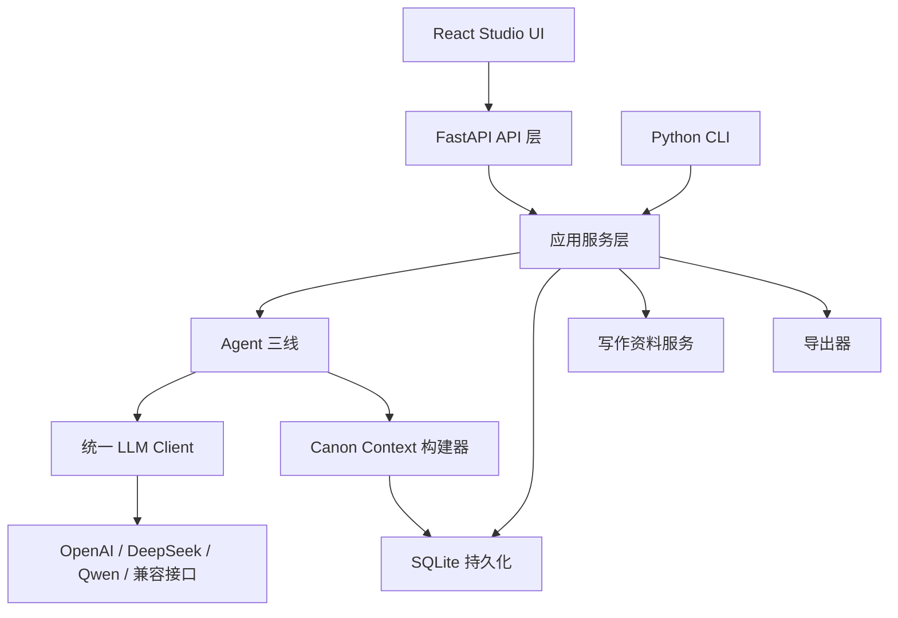
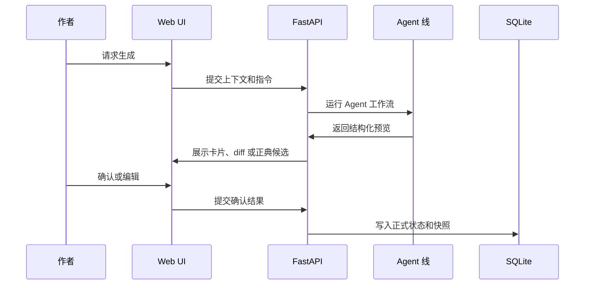
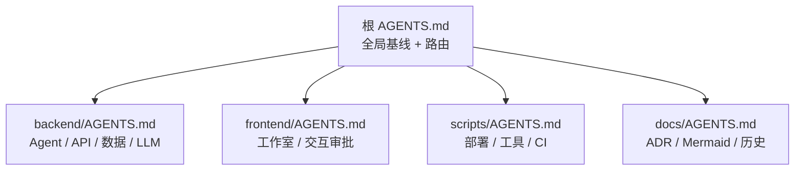
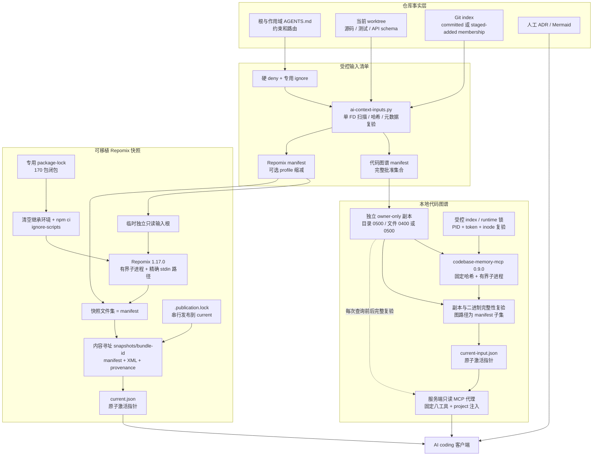

# 架构说明

叙界推演引擎 / Narraverse Engine 的核心产品原则是：

> 长篇小说生成必须是状态化、可追踪、可审查、由作者确认的。

因此，系统把立项、大纲推演、章节写作、正典管理和前端呈现拆成相对独立的层。

## 系统层级

## Agent 三线

### 创作 Star

路径：`backend/app/agents/creation_star/`

职责：

- 生成项目立项候选；
- 抽取世界观、主角、卖点、书名等候选卡；
- 生成核心矛盾、小说宪法和正典预览；
- 只在用户确认后提交正式正典。

这一条线在卡片生成阶段不得直接覆盖用户正典。

当前正式 `creation/sessions` 分步会话由 `backend/app/services/studio_service.py` 的 `StudioService` 编排；`backend/app/agents/creation_star/service.py` 承担旧兼容 draw/commit 与被复用的 lane 能力。两者不能在文档中合并成单一所有权。

### 大纲议事引擎

路径：`backend/app/services/outline_debate_service.py`

接口：`backend/app/api/v1/endpoints/outline_debate.py`

职责：

- 以回合制实时议事推演长篇总纲、逐卷卷纲和逐章章纲；
- 让多个大纲 Agent 逐条发言、交接、接收用户插话和打断；
- 从项目状态、故事圣经、canon context 和已确认大纲读取上下文；
- 每个阶段都产出可确认候选，用户确认后才写入正式大纲与正典。
- 长篇章纲可通过 `chapters/autopilot` 创建后台 parent job，按单章讨论、单章确认、单章正典更新的顺序推进，并由任务接口显示进度。

大纲线应该读取立项种子、故事圣经、canon context、角色、实体、世界观事实和已有大纲。

### 章节写作

路径：`backend/app/agents/chapter_writing/`

职责：

- 构建章节 canon context；
- 生成章节写前准备，固化章节位置、目标情绪、正典依赖、伏笔提醒和字数预算；
- 生成情节、对话、环境和整合稿；
- 执行审校、事实核查、确定性质量门、修订、风格统一和正典更新；
- 保存 Agent 轨迹和版本快照。

### 写作资料服务

路径：`backend/app/services/workbench_service.py`

职责：

- 导入已有小说正文，拆分为可审查章节草稿并生成 `import_report` 笔记；
- 保存 Method Pack，记录原则、章节配方、风格规则和反模式；
- 保存对标资产，并记录基础文本指标；
- 生成 solo、lean、full 审稿计划。

这些资料只作为上下文或参考资产，不能绕过正文提案、正典候选和人工确认边界。

## 正典模型

系统使用关系型表模拟图结构，而不是默认依赖外部图数据库：

- characters：角色卡；
- story entities：剧情实体、地点、组织、物件、线索；
- world facts：世界观事实；
- graph nodes：图节点；
- graph edges：图边；
- foreshadowing items：伏笔；
- continuity issues：连续性问题；
- version snapshots：版本快照。

这样可以保持本地启动简单，同时支持关系图谱渲染和连续性检查。

## 人工确认提交流程

多数 AI 工作流都遵循这个形状：

## 竞争力来自哪里

- 把 AI 输出视为结构化状态，而不是一次性文本。
- 允许作者检查和编辑推理链。
- 支持需要长期连续性的长篇项目。
- 本地优先，部署依赖相对轻。
- 把提示词工程、图状态和写作 UI 结合成可运行系统。

## AI 开发上下文层

以下能力是可选的开发期辅助层，不属于 React、FastAPI、SQLite 或默认 Docker 运行时。根基线与目标路径作用域规则构成项目约束，源码、测试和正式 API schema 证明实现事实，人工审阅的 ADR / Mermaid 记录稳定设计；代码图谱、profile smoke 与上下文快照只是可重建的检索或验证层。

开发规则采用混合渐进式加载。Codex 启动时会按根目录到当前工作目录合并规则；从仓库根启动的跨栈任务则由根路由显式要求读取目标作用域：

具体决策与容量预算见 [ADR-0002](adr/0002-layered-agents-guidance.md)。AI 上下文的当前安全边界见 [ADR-0003](adr/0003-verifiable-ai-context-boundary.md)。

受控路径使用 dirfd、no-follow、当前 UID 和 inode 复验；同一文件描述符的一次读取同时完成密钥扫描、哈希、大小与 mode 记录。可写 cache/build/lock 目录为 `0700`，只读输入目录为 `0500`，权限修复失败即停止。代码图谱索引和刷新只能由受控脚本显式触发，自动 watcher 关闭。独占 index 锁阻止并发构建争用激活状态，runtime 锁串行化安全配置写入；两者都校验锁目录、owner token、PID 与 inode。有效 owner 仅在 PID 不再存活时回收；创建中断留下的精确空锁或仅含 `.owner.pending.<token>` 的状态可在超过 5 秒 grace 后恢复，异常类型或文件集失败关闭。服务端代理不向模型暴露项目选择、索引或写能力；客户端 `enabled_tools` 只是第二层白名单。每次查询在原生调用前后复验绑定的独立输入副本和固定哈希的原生二进制，后验失败时不返回结果。

图谱的 `current-input.json` 与快照的 `current.json` 都是构建和验证完成后的规范激活指针。“原子”只描述单个指针替换，不表示底层图数据库或多个便利 symlink 构成跨步骤事务。代码图谱只要求已索引路径是 manifest 的非空、未截断子集；Repomix 则要求输出路径集合与 manifest 完全相等，并把快照 SHA-256 纳入 bundle ID、provenance 和当前指针。`.publication.lock` 串行保护 build rename、bundle 验证、retention/quarantine、便利 links 与 `current.json`；发布器在激活前把待删除旧 bundle 原子改名到受控 quarantine，任一步失败都保留原活动指针。

Repomix 的 package/lock/config 先以 no-follow 文件描述符复制并前后复验，再在清空继承环境的有界子进程中安装和生成；超时、I/O 越界、快照超过 512 MiB 或同组后台进程会失败关闭。profile 固定为 `full`、`backend`、`frontend`、`tooling`，只能缩小批准集合。9 场景离线 smoke 精确覆盖双 API 前缀、创作 Star、大纲议事、章节写作、批量生成、`approve_canon_proposal` 正典审批、前端大纲、前端提案应用和 tooling/CI；独立真实检索入口则在已重建图谱上逐题执行 `search_code`，统计文件级 hit@10 和 MRR。后者仍不等同于调用边方向、任意查询 precision/recall、snippet 或生成确定性评测。

`.codebase-memory/` 与 `.ai-context/` 均是 Git 忽略的潜在敏感生成物，不得提交或默认上传。DeepWiki Open 仍未启用，不在活跃链路中；前三阶段完成不会自动授权其克隆、安装、运行或缓存。操作细节见 [AI 辅助开发上下文](ai-assisted-development.md)，当前发布候选的验收范围与最终实测结果见 [2026-07-22 发布候选验收报告](test-reports/2026-07-22-ai-context-release-candidate-validation.md)。
