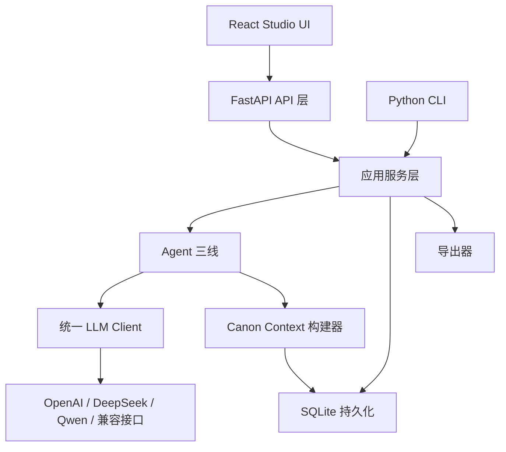
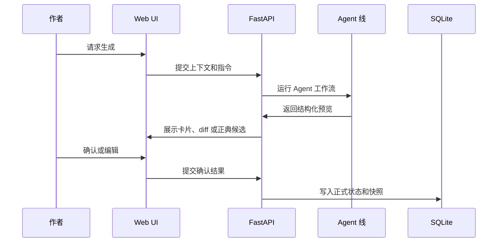

# 架构说明

叙界推演引擎 / Narraverse Engine 的核心产品原则是：

> 长篇小说生成必须是状态化、可追踪、可审查、由作者确认的。

因此，系统把立项、大纲推演、章节写作、正典管理和前端呈现拆成相对独立的层。

## 系统层级

## Agent 三线

### 创作 Star

路径：`backend/app/agents/creation_star/`

职责：

- 生成项目立项候选；
- 抽取世界观、主角、卖点、书名等候选卡；
- 生成核心矛盾、小说宪法和正典预览；
- 只在用户确认后提交正式正典。

这一条线在卡片生成阶段不得直接覆盖用户正典。

### 大纲 Swarm

路径：`backend/app/agents/outline_swarm/`

职责：

- 推演长篇总纲和卷纲；
- 使用 `langgraph-swarm` 做 active-agent 动态交接；
- 从 `backend/app/prompts/` 加载提示词任务；
- 生成可预览、可确认的大纲和章纲。

大纲线应该读取立项种子、故事圣经、canon context、角色、实体、世界观事实和已有大纲。

### 章节写作

路径：`backend/app/agents/chapter_writing/`

职责：

- 构建章节 canon context；
- 生成情节、对话、环境和整合稿；
- 执行审校、事实核查、质量门、修订、风格统一和正典更新；
- 保存 Agent 轨迹和版本快照。

## 正典模型

系统使用关系型表模拟图结构，而不是默认依赖外部图数据库：

- characters：角色卡；
- story entities：剧情实体、地点、组织、物件、线索；
- world facts：世界观事实；
- graph nodes：图节点；
- graph edges：图边；
- foreshadowing items：伏笔；
- continuity issues：连续性问题；
- version snapshots：版本快照。

这样可以保持本地启动简单，同时支持关系图谱渲染和连续性检查。

## 人工确认提交流程

多数 AI 工作流都遵循这个形状：

## 竞争力来自哪里

- 把 AI 输出视为结构化状态，而不是一次性文本。
- 允许作者检查和编辑推理链。
- 支持需要长期连续性的长篇项目。
- 本地优先，部署依赖相对轻。
- 把提示词工程、图状态和写作 UI 结合成可运行系统。
