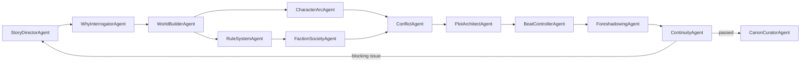
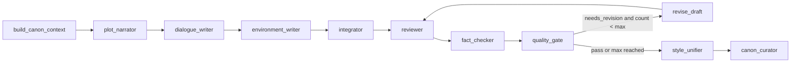

# Agents 三线重构与 LangGraph Swarm 大纲推演设计

日期：2026-06-08  
状态：待用户确认  
范围：只设计 `backend/app/agents` 与其直接服务层边界，不重构前端页面，不替换数据库模型，不删除现有 API。

## 1. 背景

当前 Agent 相关代码混在几套并行实现里：

- `backend/app/agents/workflow.py`：正文写作 StateGraph，包含初始化、章节规划、单章正文生成、质量门和设定整理。
- `backend/app/agents/outline_workflow.py`、`outline_agents.py`、`outline_models.py`：13-Agent 长篇大纲推演，主要是固定阶段顺序。
- `backend/app/agents/canon_workflow.py`：正典补全流程和 handoff 图，但流程是手写顺序执行，且存在示例故事硬编码。
- `backend/app/services/studio_service.py`：包含创作 Star、设定生成、大纲服务、导出和大量辅助逻辑，职责过重。

目标是拆成三套相互独立的 Agent 产品线：

1. 初始 Star：抽卡式立项。
2. 大纲生成：结合世界构建，使用 `langgraph_swarm` 动态推演循环。
3. 章节写作：稳定正文生成与审校。

## 2. 非目标

- 不重写整个 FastAPI 项目。
- 不改变现有 API 路径；只把实现迁移到新的 service/agent 模块。
- 不把章节写作改成 Swarm。
- 不删除旧文件，旧文件先作为兼容入口保留。
- 不引入 Neo4j、复杂向量数据库、登录系统或云协作。
- 不让前端直接访问 LLM API Key。

## 3. 目标目录

```text
backend/app/agents/
├── shared/
│   ├── __init__.py
│   ├── contracts.py
│   ├── llm.py
│   ├── prompt_loader.py
│   ├── trace.py
│   ├── canon_context.py
│   └── handoff.py
│
├── creation_star/
│   ├── __init__.py
│   ├── state.py
│   ├── agents.py
│   ├── prompts/
│   │   └── creation_star.md
│   ├── workflow.py
│   └── service.py
│
├── outline_swarm/
│   ├── __init__.py
│   ├── state.py
│   ├── agents.py
│   ├── tools.py
│   ├── prompts/
│   │   ├── story_director.md
│   │   ├── why_interrogator.md
│   │   ├── world_builder.md
│   │   ├── rule_system.md
│   │   ├── character_arc.md
│   │   ├── faction_society.md
│   │   ├── conflict.md
│   │   ├── plot_architect.md
│   │   ├── beat_controller.md
│   │   ├── foreshadowing.md
│   │   ├── continuity.md
│   │   └── canon_curator.md
│   ├── swarm.py
│   ├── validators.py
│   └── service.py
│
└── chapter_writing/
    ├── __init__.py
    ├── state.py
    ├── agents.py
    ├── prompts/
    ├── workflow.py
    ├── quality_gate.py
    └── service.py
```

旧模块保留并逐步变薄：

- `workflow.py` 迁移到 `chapter_writing/workflow.py` 后保留转发导入。
- `outline_workflow.py` 迁移到 `outline_swarm/service.py` 或作为 legacy 固定流程入口。
- `canon_workflow.py` 保留为兼容入口，但不再写硬编码故事内容。
- `studio_service.py` 只做 API 编排，创作 Star、大纲、正文分别调用三条线的 service。

## 4. 三条线职责

### 4.1 初始 Star

职责：

- 频道、类型、细分类型、标签选择。
- 世界观抽卡。
- 主角人设抽卡。
- 项目总设定表。
- 世界观规则表。
- 书名抽卡。
- 用户确认后写入项目、故事圣经、角色、实体、世界观事实和图谱。

实现方式：

- 使用普通服务或简单 StateGraph。
- 不使用 Swarm。
- 每一步必须读取前面步骤结果。
- Agent 只生成候选卡，不直接写正式正典。

输出：

```python
CreationStarResult = {
    "basic": {},
    "worldview_cards": [],
    "protagonist_cards": [],
    "project_bible_cards": [],
    "world_rule_cards": [],
    "title_cards": [],
    "prompt_snapshot": {},
}
```

### 4.2 大纲生成

职责：

- 读取创作 Star 结果、用户补充、已有正典和前文摘要。
- 动态构建世界观、规则体系、势力、角色弧光、冲突矩阵。
- 生成总纲、卷纲、章节节拍、伏笔账本和连续性审查报告。
- 抽取新增实体并写入正典候选或正式正典。

实现方式：

- 使用 `langgraph_swarm`。
- Agent 通过 handoff tool 动态交接，不使用硬编码固定故事内容。
- 用工具函数写入正典、创建补全 ticket、查询 canon context、记录 trace。
- 用 validator 控制停止条件。

核心 Agent：

```text
StoryDirectorAgent
WhyInterrogatorAgent
WorldBuilderAgent
RuleSystemAgent
CharacterArcAgent
FactionSocietyAgent
ConflictAgent
PlotArchitectAgent
BeatControllerAgent
ForeshadowingAgent
ContinuityAgent
CanonCuratorAgent
```

动态循环：



停止条件：

- `iteration_count >= max_iterations`。
- 连续性评分达到阈值。
- 没有 blocking continuity issue。
- S/A 级实体全部补全。
- 目标卷数、章节数、节拍表数量达标。
- LLM 或工具连续失败达到上限。

### 4.3 章节写作

职责：

- 读取 canon context 和当前章纲。
- 生成情节、对话、环境、整合稿。
- 审核修改、事实核查、质量门、修订、风格统一。
- 输出最终章节、章节摘要和设定候选更新。

实现方式：

- 使用稳定 `StateGraph`。
- 不使用 Swarm。
- 增强现有质量门循环。

目标流程：



## 5. 大纲 Swarm 状态模型

`OutlineSwarmState` 必须使用 pydantic v2。

核心字段：

```python
class OutlineSwarmState(APIModel):
    project_id: str
    seed: dict
    canon_context: dict
    story_bible: dict
    characters: list[dict]
    story_entities: list[dict]
    world_facts: list[dict]
    graph_nodes: list[dict]
    graph_edges: list[dict]
    outline: dict
    volume_outlines: list[dict]
    chapter_beats: list[dict]
    foreshadowing_items: list[dict]
    continuity_issues: list[dict]
    completion_tickets: list[dict]
    uncertainty_tickets: list[dict]
    active_agent: str
    agent_trace: list[dict]
    iteration_count: int
    max_iterations: int
    status: Literal["running", "passed", "failed", "needs_user_review"]
```

共享输入必须来自数据库或用户输入，不得写死故事名、势力名、物品名、世界规则。

## 6. Swarm 工具

大纲 Swarm 中 Agent 不能直接改数据库，只能调用工具。工具返回结构化结果，并记录 trace。

必要工具：

- `get_canon_context(project_id)`：读取项目、故事圣经、角色、实体、世界观事实、图谱、未解决问题、前文摘要。
- `upsert_canon_candidate(payload)`：写入候选正典，保留来源、置信度和原因。
- `create_completion_ticket(entity)`：创建 S/A 实体补全任务。
- `create_uncertainty_ticket(question)`：记录不确定项。
- `record_outline_piece(kind, payload)`：记录总纲、卷纲或章节节拍草案。
- `run_continuity_check()`：检查实体完整度、因果链、时间线、伏笔、规则冲突。
- `mark_ready_for_user_review()`：当停止条件满足时结束 Swarm。

## 7. Prompt 规则

所有大纲 Swarm Agent prompt 必须独立保存在 `outline_swarm/prompts/`，不得再塞进单个巨大 `prompts.py`。

全局规则：

- 多问为什么。
- 不确定不硬编。
- S/A 级实体必须补全。
- 每个剧情节点必须有戏剧功能。
- 严格区分危机、高潮、结果。
- 所有新设定必须可合并进正典库。
- 不得使用示例硬编码世界观。

每个 Agent 输出必须包含：

```text
当前判断
Why Chain
新增内容
对已有内容的影响
新增实体
不确定项
建议 handoff
```

## 8. API 与服务迁移

现有 API 路径保持不变：

- 创作 Star：`/api/creation-star/options`、`/api/projects/{id}/creation-star/draw`、`commit`
- 大纲：`/api/projects/{id}/chapters/plan`、`/api/projects/{id}/canon-studio/run`
- 正文：`/api/projects/{id}/chapters/{chapter_id}/draft`

内部实现改为：

```text
studio_service.creation_star_* -> creation_star.service
studio_service.plan_chapters -> outline_swarm.service
canon_service.run_canon_workflow -> outline_swarm.service 或兼容 wrapper
generation_service / workflow.py -> chapter_writing.service
```

## 9. 依赖

新增后端依赖：

```text
langgraph-swarm
```

是否需要完整 `langchain` 取决于实现方式：

- 如果使用官方 `langchain.agents.create_agent` 示例，需要补 `langchain`。
- 如果直接用 LangGraph/自定义 agent runnable 适配 Swarm，先不引入完整 `langchain`。

推荐第一阶段只新增 `langgraph-swarm`，保守接入；若实际 API 需要，再补 `langchain` 并更新 `Codex.md`。

## 10. 测试策略

新增测试：

- `test_agents_directory_contract.py`：三条线目录存在，旧入口只做兼容。
- `test_outline_swarm_state.py`：状态模型校验、停止条件校验。
- `test_outline_swarm_no_hardcoded_story.py`：大纲 Swarm 源码不得包含示例故事硬编码，如“龙骨能源”“最后真龙封印”等。
- `test_outline_swarm_tools.py`：工具只写候选正典，不直接覆盖用户设定。
- `test_chapter_quality_loop.py`：质量门可回到 reviewer/fact_checker，且受 `max_revisions` 限制。
- `test_creation_star_service.py`：每步抽卡读取前序结果，commit 后写入项目设定。

回归测试：

- 后端全量 pytest。
- 前端契约测试。
- 前端 build。

## 11. 迁移步骤

阶段 1：结构落地  
创建三条线目录和 shared 模块，旧代码不迁移，先加结构契约测试。

阶段 2：创作 Star 拆出  
把 `studio_service.py` 中 `creation_star_*` 和相关 helper 搬到 `creation_star/service.py`，API 行为不变。

阶段 3：章节写作拆出  
把 `workflow.py` 迁移到 `chapter_writing/workflow.py`，增强质量门循环：`revise_draft -> reviewer -> fact_checker -> quality_gate`。

阶段 4：大纲 Swarm 骨架  
新增 `outline_swarm/state.py`、`tools.py`、`swarm.py`、`validators.py`，用 MockLLM 和本地工具跑通，不接真实 LLM。

阶段 5：去硬编码  
替换 `canon_workflow.py` 中示例故事硬编码，改为从 `CanonRunRequest`、数据库 canon context、用户输入生成。

阶段 6：接入 API  
`plan_chapters` 和 `canon-studio/run` 改为调用 `outline_swarm.service`，旧实现保留 fallback。

阶段 7：真实 LLM 冒烟  
用 DeepSeek/Qwen/OpenAI compatible provider 跑一次短流程，检查 trace、停止条件、正典候选和输出。

## 12. 风险与控制

风险：Swarm 动态循环无法停止。  
控制：强制 `max_iterations`、连续失败上限、质量阈值和 token 预算。

风险：Agent 互相甩锅，输出空泛。  
控制：每个 Agent 必须输出结构化字段和下一步原因，ContinuityAgent 对空泛内容判失败。

风险：AI 覆盖用户设定。  
控制：Swarm 工具只写候选正典；正式写入仍走用户审批或明确 commit 流程。

风险：一次性迁移破坏现有功能。  
控制：旧入口保留 fallback，每阶段跑全量测试。

## 13. 验收标准

- `backend/app/agents` 下三条线清晰存在，旧文件不再继续承载新增业务。
- 创作 Star、章节写作、大纲生成可以分别独立测试。
- 大纲生成使用 `langgraph_swarm`，不再是固定硬编码流程。
- 大纲生成没有示例故事硬编码。
- 大纲 Swarm 能基于用户世界观和一句话故事生成结构化总纲、卷纲、章纲、正典候选和连续性报告。
- Swarm 循环有明确停止条件。
- 无 API Key 时仍可使用 Mock/规则化回退跑通。
- 现有 API 路径不变，前端无需大规模改造。

## 14. 待确认问题

默认方案：只让“大纲生成线”使用 `langgraph_swarm`，创作 Star 和章节写作继续使用更稳定的线性流程。

需要用户确认：

1. 是否接受新增依赖 `langgraph-swarm`。
2. 是否接受 `canon_workflow.py` 逐步降级为兼容 wrapper。
3. 是否接受大纲 Swarm 首版只写候选正典，不自动覆盖正式设定。
